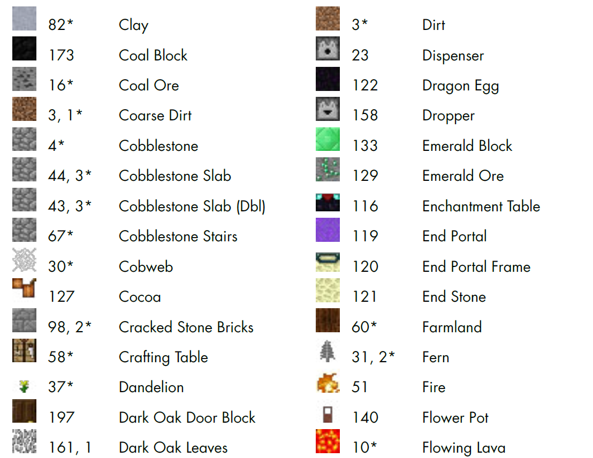
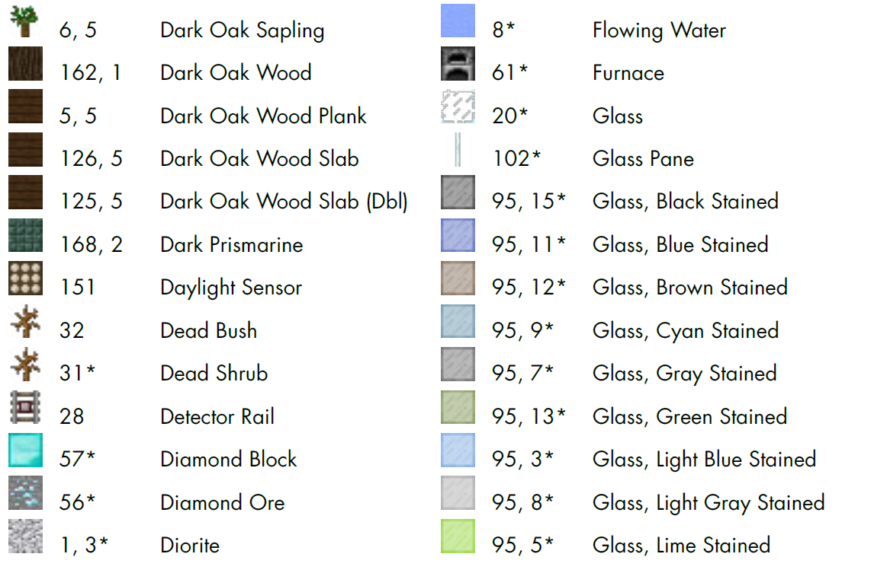
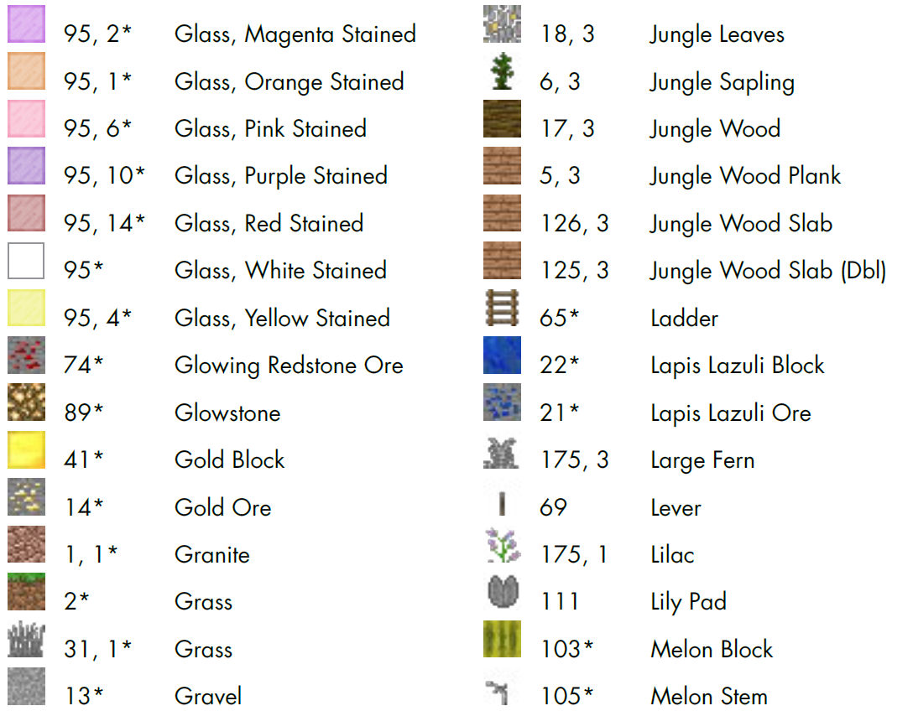

chapter 3: Building Quickly and Traveling Far with Math
==========================================================

이 장에서는 블락과 복잡한 구조물을 만드는 법을 배우도록 하겠다.

3.1 Expressions and Statements
----------------------------------
You can combine values, variables, and operators to create small pieces
of code called expressions, like 2 + 2. Expressions can be combined into
statements

3.2 Operators
-------------------

operators are used to alter and combine numbers.

Addition
~~~~~~~~~~~~

다음은 출력해 보자

.. code-block:: python

    from mcpi.minecraft import Minecraft
    mc = Minecraft.create()

    mc.postToChat(3+4)

Mission #5: Stack Blocks
~~~~~~~~~~~~~~~~~~~~~~~~~~

여기서는 setBlock() 함수를 써보자
다음 코드에서 알수 있듯이 x,y,z,blockid가 들어간다.
다음을 실행해 보자.
block id =0 인경우는 Air로 블럭을 지우는 효과가 있다.

.. code-block:: python

    from mcpi.minecraft import Minecraft
    import time
    mc = Minecraft.create()

    # x = 6
    # y = 5
    # z = 28
    x = 100
    y = 1
    z = -100
    # pos = mc.player.getTilePos()
    # x = pos.x
    # y = pos.y
    # z = pos.z

    time.sleep(2)
    mc.player.setPos(x,y,z-5)

    blockType = 103
    #blockType = 0
    mc.setBlock(x, y, z, blockType)

    time.sleep(2)

    y = y + 1
    mc.setBlock(x, y, z, blockType)
    time.sleep(2)

    y = y + 1
    mc.setBlock(x, y, z, blockType)

    time.sleep(2)
    y = y + 1
    mc.setBlock(x, y, z, blockType)

block id는 아래 자세히 나와 있다.

.. image:: ./img/chapter3-4.png
.. image:: ./img/chapter3-5.png
.. image:: ./img/chapter3-6.png
.. image:: ./img/chapter3-7.png
.. image:: ./img/chapter3-8.png
.. image:: ./img/chapter3-9.png

Mission #6: Super Jump
~~~~~~~~~~~~~~~~~~~~~~~~~~
점프를 해보자.
다음 코드를 실행해 보자.

.. code-block:: python

    from mcpi.minecraft import Minecraft
    import time

    mc = Minecraft.create()

    position = mc.player.getTilePos()
    x = position.x
    y = position.y
    z = position.z

    y = y + 10
    time.sleep(5)
    mc.player.setTilePos(x, y, z)

Subtraction
~~~~~~~~~~~~~~~~~~~

다음 코드를 실행해 보자.

.. code-block:: python

    from mcpi.minecraft import Minecraft
    mc = Minecraft.create()

    mc.postToChat(3-4)

Mission #7: Change the Blocks Under You
~~~~~~~~~~~~~~~~~~~~~~~~~~~~~~~~~~~~~~~~~~~~

발밑에 용암을 만들고 용암에 빠지지 않도록 이동하는 미션을 수행해 보자.

.. code-block:: python

    from mcpi.minecraft import Minecraft
    import time

    mc = Minecraft.create()

    pos = mc.player.getTilePos()
    x = pos.x
    y = pos.y
    z = pos.z
    blockType = 10

    y = y - 1

    time.sleep(5)

    mc.setBlock(x, y, z, blockType)

    mc.player.setTilePos(x-3,y,z-3)

Using Math Operators in Arguments
~~~~~~~~~~~~~~~~~~~~~~~~~~~~~~~~~~~

다음 코드를 실행해 보자.
전달자에 바로 연산자를 넣어서 전달할 수 있다.

.. code-block:: python

    from mcpi.minecraft import Minecraft
    mc = Minecraft.create()

    x = 145
    y = 4
    z = -39
    blockType = 103
    mc.setBlock(x, y, z, blockType)
    mc.setBlock(x, y+1, z, blockType)
    mc.setBlock(x+2, y , z, blockType)

또는 변수를 지정해서 값을 넣은후 전달해도 된다.

.. code-block:: python

    from mcpi.minecraft import Minecraft
    mc = Minecraft.create()

    x = 6
    y = 1
    z = 28
    blockType = 103
    mc.player.setTilePos(x,y,z-5)
    up = 1
    mc.setBlock(x, y, z, blockType)
    mc.setBlock(x, y + up, z, blockType)

Mission #8: Speed Building
~~~~~~~~~~~~~~~~~~~~~~~~~~~~~

간단한 빌딩을 지어 보자.

다음 코드를 실행해 보자

.. code-block:: python

    from mcpi.minecraft import Minecraft
    import time

    mc = Minecraft.create()

    mc.player.setTilePos(20,4,20)

    pos = mc.player.getTilePos()
    x = pos.x
    y = pos.y
    z = pos.z

    width = 3
    height = 3
    length = 3
    blockType = 4
    """
    width = 142
    height = 4
    length = -40
    """

    blockType = 4
    air = 0
    mc.player.setTilePos(3,3,3-5)

    time.sleep(5)

    mc.setBlocks(x, y, z, x + width, y + height, z + length, blockType)
    # mc.setBlocks(x + 1, y + 1, z + 1,
                 # x + width - 1, y + height - 1, z + length - 1, air)
    mc.setBlocks(x + 1, y + 1, z + 1,x + width - 2, y + height - 2, z + length - 2, 0)

Multiplication
~~~~~~~~~~~~~~~~~
다음 코드를 실행해 보자.

.. code-block:: python

    from mcpi.minecraft import Minecraft
    mc = Minecraft.create()

    mc.postToChat(3*4)

Division
~~~~~~~~~~~~~~~~~

다음 코드를 실행해 보자.

.. code-block:: python

    from mcpi.minecraft import Minecraft
    import time
    mc = Minecraft.create()

    mc.postToChat(12/3)
    time.sleep(2)
    mc.postToChat(12%3)

    time.sleep(2)
    mc.postToChat(12//5)

Mission #9: Spectacular Spires
~~~~~~~~~~~~~~~~~~~~~~~~~~~~~~~~~~~~~

탑을 쌓는 코드를 짜보자.

.. code-block:: python

    from mcpi.minecraft import Minecraft
    import time

    mc = Minecraft.create()

    pos = mc.player.getTilePos()
    x = pos.x
    y = pos.y
    z = pos.z

    height = 3
    blockType = 1

    time.sleep(3)

    # Spire sides: should be same as height
    sideHeight = height
    mc.setBlocks(x + 1, y, z + 1, x + 3, y + sideHeight - 1, z + 3, blockType)

    time.sleep(3)
    # Spire point: should be two times the height
    pointHeight = height * 2
    mc.setBlocks(x + 2, y, z + 2, x + 2, y + pointHeight - 1, z + 2, blockType)

    time.sleep(3)
    # Spire base: should be half the height
    baseHeight = height / 2
    mc.setBlocks(x, y, z, x + 4, y + baseHeight - 1, z + 4, blockType)

3.3 Exponents
-------------------

3*3*3*3 을 실행해 보자.

다음 코드를 실행해 보자.

.. code-block:: python

    from mcpi.minecraft import Minecraft
    mc = Minecraft.create()

    mc.postToChat(3*3*3*3)

3.4 Parentheses and Order of Operations
------------------------------------------
연산자의 우선순위에 관한 문제이다.
When you’re using multiple operators, division and multiplication are
evaluated first from left to right, and then addition and subtraction are
calculated

다음 코드를 실행해 보자.

.. code-block:: python

    from mcpi.minecraft import Minecraft
    import time
    mc = Minecraft.create()

    time.sleep(2)

    vars=5*2-1+4/2

    mc.postToChat(vars)

    time.sleep(2)
    mc.postToChat(5*2-1+4/2)

    time.sleep(2)
    mc.postToChat(6*3-2)

    time.sleep(2)
    mc.postToChat(6*(3-2))

3.5 Handy Math Tricks
-------------------

Shorthand Operators
~~~~~~~~~~~~~~~~~~~~

코딩에서 쓰이는 축약 연산 표현이다.

sheep=6
sheep=sheep+5
sheep +=5

다음과 같이 많이 쓰인다.

.. sourcecode:: pycon

    • Addition (+=)        var= var+x
    • Subtraction (-=)     var= var-x
    • Multiplication (*=)  var= var*x
    • Division (/=)        var= var/x

Playing with Random Numbers
~~~~~~~~~~~~~~~~~~~~~~~~~~~~~

파이썬은 임의의 숫자를 생성하는 함수를 제공한다.

import random
diceValue = random.randint(1, 6)

Mission #10: Super Jump Somewhere New!
~~~~~~~~~~~~~~~~~~~~~~~~~~~~~~~~~~~~~~~~~~~~~

다음 코드를 실행해 보자

.. code-block:: python

    from mcpi.minecraft import Minecraft
    import time

    mc = Minecraft.create()
    mc.player.setTilePos(100,4,20)
    import random

    pos = mc.player.getPos()
    x = pos.x
    y = pos.y
    z = pos.z
    time.sleep(5)

    x += random.randrange(-10, 11)
    y += random.randrange(0, 11)
    z += random.randrange(-10, 11)
    mc.player.setPos(x, y, z)

3.5 What You Learned
------------------------

addition, subtraction, multiplication, and division

random numbers
